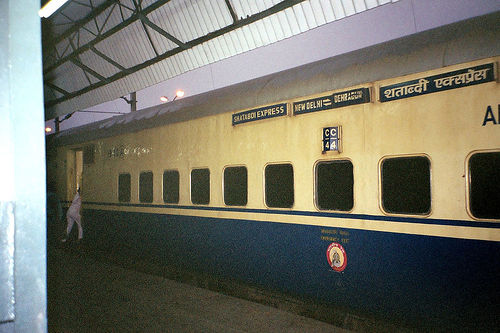

# SSD(Single Shot MultiBox Detector)の実装

## 目標
- SSDの論文理解
- SSDの0からの実装

## 1. SSDの処理の流れの確認
SSDによる学習時の処理の流れを次に示す.
1. 画像を300x300にリサイズする
2. 画像をSSDのネットワークに入力する
3. バウンディングボックスの候補を作成する8,732個のデフォルトボックスを作成し, loc, confの出力
4. 損失関数による損失値の計算
5. バックプロパゲーションによる重みの更新

SSDによる推論時の処理の流れを次に示す.
1. 画像を300x300にリサイズする
2. 画像をSSDのネットワークに入力し, locネットワークとconfネットワークの推論結果(デフォルトボックス)を得る
3. デフォルトボックスの情報を次の処理によって1物体につき1つに絞り込む
    1. 確信度が上位200個のデフォルトボックスを抽出する
    2. 抽出したデフォルトボックスに変換を加え, 同じ物体を検出したバウンディングボックスの中で最も確信度が高いものだけを残して他は排除する


## 2. データセットの用意と前処理
SSDの学習にはVOC2012というデータセットを用いる. データセットをDL, 解凍するためにload_preprocess_data.ipynbを実行する.
これによってdata/およびweights/にデータセットと学習済み重みがダウンロードされ, 解凍が行われる.

## 3. 画像とアノテーションファイルのパスを取得する関数
データはdata//VOCdevkit/VOC2012/に次のような構成で配置されている. アノテーションファイルは/Annotationsにyml形式, 画像は/JPEGImagesにjpg形式格納されている. これらのアノテーションファイルと画像は学習用と検証用どちらも同じディレクトリに配置されている. 学習用ファイルか検証用ファイルかはdata//VOCdevkit/VOC2012/ImageSets/Mainのtrain.txtおよびval.txtに記述されている. train.txtおよびval.txtの内容を次に示す. これらは拡張子なしで画像およびアノテーションファイルに割り当てられた番号を表している. ここではvoc.pyにtrain.txtおよびval.txtから読み取った番号を, 画像およびアノテーションファイルのパスに置き換えたリストを作成するmake_filepath_list関数を作成する. そしてmake_filepath_list関数のテストをtest_voc2012_dataloader.ipynbで行う.
```
.
|-- Annotations
|-- ImageSets
|-- JPEGImages
|-- SegmentationClass
`-- SegmentationObject
```

train.txt
```
2008_000008
2008_000015
2008_000019
2008_000023
2008_000028
```

val.txt
```
2008_000002
2008_000003
2008_000007
2008_000009
2008_000016
```

## 4. B-Boxの座標と正解ラベルをリスト化するクラスの作成
ここではアノテーションファイルを読み込んで, Bounding Box(B-Box)と正解ラベルをリスト化するGetBBoxAndLabelクラスを作成する. このクラスを作成するために, まずアノテーションファイルとそれに対応する画像を見てみる. 例として2008_000003を扱う. 2008_000003.jpgおよび2008_000003.xmlを次に示す. まず, \<size\>に画像の大きさとチャネル数が記述されていることがわかる. 次に\<object\>に2つのオブジェクト(train, person)にname:物体名, bndbox:B-Box, difficult:難易度が記述されていることがわかる. difficultは0のとき平易, 1のとき困難であることを表す.

```yml
<annotation>
	<folder>VOC2012</folder>
	<filename>2008_000003.jpg</filename>
	<source>
		<database>The VOC2008 Database</database>
		<annotation>PASCAL VOC2008</annotation>
		<image>flickr</image>
	</source>
	<size>
		<width>500</width>
		<height>333</height>
		<depth>3</depth>
	</size>
	<segmented>0</segmented>
	<object>
		<name>train</name>
		<pose>Unspecified</pose>
		<truncated>1</truncated>
		<occluded>0</occluded>
		<bndbox>
			<xmin>46</xmin>
			<ymin>11</ymin>
			<xmax>500</xmax>
			<ymax>333</ymax>
		</bndbox>
		<difficult>0</difficult>
	</object>
	<object>
		<name>person</name>
		<pose>Right</pose>
		<truncated>1</truncated>
		<occluded>0</occluded>
		<bndbox>
			<xmin>62</xmin>
			<ymin>190</ymin>
			<xmax>83</xmax>
			<ymax>243</ymax>
		</bndbox>
		<difficult>0</difficult>
	</object>
</annotation>

``` 
目標としてはこのファイル群から次のようなリストを作成する. B-Boxの座標空間は左上の座標を(1,1)として, 矩形の左上を(xmin, ymin), 右下を(xmax,ymax)で表す. このためそれぞれの値から1を引くことで原点(0,0)とするB-Boxに変換できる. またここでは20クラスのマルチクラス分類に1クラス(背景)を加えた21クラスを扱う. このためindexの番号は0以上20以下の21通りある. 
```
[[xmin,ymin,xmax,ymax,index], ... , [xmin,ymin,xmax,ymax,index]]
```

さらにリストに格納するときにB-Boxの各値を正規化する処理を行う. 正規化はxmin/width, xmax/width, ymin/height, ymax/heightで行う. またdifficult==1, すなわち検出困難な物体はここでは除外することにする. これらを踏まえてvoc.pyにGetBBoxAndLabelクラスを作成する.