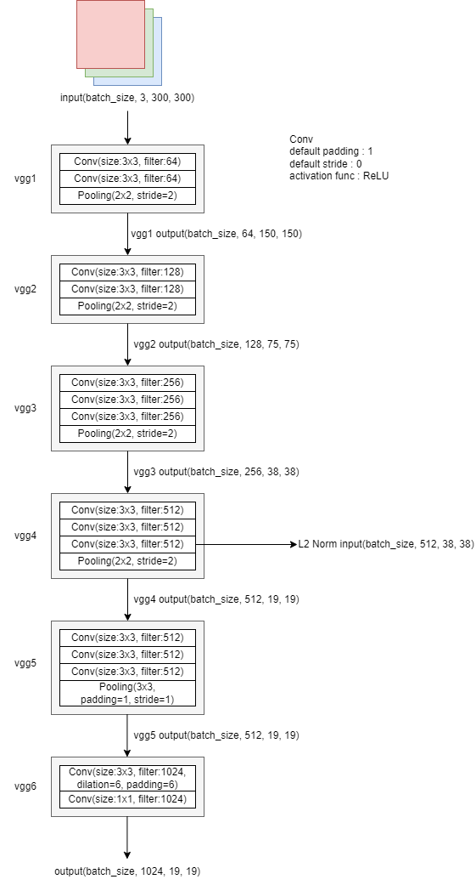

# SSD(Single Shot MultiBox Detector)の実装

## 目標
- SSDの論文理解
- SSDの0からの実装

## 1. SSDの処理の流れの確認
SSDによる学習時の処理の流れを次に示す.
1. 画像を300x300にリサイズする
2. 画像をSSDのネットワークに入力する
3. バウンディングボックスの候補を作成する8,732個のデフォルトボックスを作成し, loc, confの出力
4. 損失関数による損失値の計算
5. バックプロパゲーションによる重みの更新

SSDによる推論時の処理の流れを次に示す.
1. 画像を300x300にリサイズする
2. 画像をSSDのネットワークに入力し, locネットワークとconfネットワークの推論結果(デフォルトボックス)を得る
3. デフォルトボックスの情報を次の処理によって1物体につき1つに絞り込む
    1. 確信度が上位200個のデフォルトボックスを抽出する
    2. 抽出したデフォルトボックスに変換を加え, 同じ物体を検出したバウンディングボックスの中で最も確信度が高いものだけを残して他は排除する


## 2. データセットの用意と前処理
SSDの学習にはVOC2012というデータセットを用いる. データセットをDL, 解凍するためにload_preprocess_data.ipynbを実行する.
これによってdata/およびweights/にデータセットと学習済み重みがダウンロードされ, 解凍が行われる.

## 3. 画像とアノテーションファイルのパスを取得する関数
データはdata//VOCdevkit/VOC2012/に次のような構成で配置されている. アノテーションファイルは/Annotationsにyml形式, 画像は/JPEGImagesにjpg形式格納されている. これらのアノテーションファイルと画像は学習用と検証用どちらも同じディレクトリに配置されている. 学習用ファイルか検証用ファイルかはdata//VOCdevkit/VOC2012/ImageSets/Mainのtrain.txtおよびval.txtに記述されている. train.txtおよびval.txtの内容を次に示す. これらは拡張子なしで画像およびアノテーションファイルに割り当てられた番号を表している. ここではvoc.pyにtrain.txtおよびval.txtから読み取った番号を, 画像およびアノテーションファイルのパスに置き換えたリストを作成するmake_filepath_list関数を作成する. そしてmake_filepath_list関数のテストをtest_voc2012_dataloader.ipynbで行う.
```
.
|-- Annotations
|-- ImageSets
|-- JPEGImages
|-- SegmentationClass
`-- SegmentationObject
```

train.txt
```
2008_000008
2008_000015
2008_000019
2008_000023
2008_000028
```

val.txt
```
2008_000002
2008_000003
2008_000007
2008_000009
2008_000016
```

## 4. B-Boxの座標と正解ラベルをリスト化するクラスの作成
ここではアノテーションファイルを読み込んで, Bounding Box(B-Box)と正解ラベルをリスト化するGetBBoxAndLabelクラスを作成する. このクラスを作成するために, まずアノテーションファイルとそれに対応する画像を見てみる. 例として2008_000003を扱う. 2008_000003.jpgおよび2008_000003.xmlを次に示す. まず, \<size\>に画像の大きさとチャネル数が記述されていることがわかる. 次に\<object\>に2つのオブジェクト(train, person)にname:物体名, bndbox:B-Box, difficult:難易度が記述されていることがわかる. difficultは0のとき平易, 1のとき困難であることを表す.  

```yml
<annotation>
	<folder>VOC2012</folder>
	<filename>2008_000003.jpg</filename>
	<source>
		<database>The VOC2008 Database</database>
		<annotation>PASCAL VOC2008</annotation>
		<image>flickr</image>
	</source>
	<size>
		<width>500</width>
		<height>333</height>
		<depth>3</depth>
	</size>
	<segmented>0</segmented>
	<object>
		<name>train</name>
		<pose>Unspecified</pose>
		<truncated>1</truncated>
		<occluded>0</occluded>
		<bndbox>
			<xmin>46</xmin>
			<ymin>11</ymin>
			<xmax>500</xmax>
			<ymax>333</ymax>
		</bndbox>
		<difficult>0</difficult>
	</object>
	<object>
		<name>person</name>
		<pose>Right</pose>
		<truncated>1</truncated>
		<occluded>0</occluded>
		<bndbox>
			<xmin>62</xmin>
			<ymin>190</ymin>
			<xmax>83</xmax>
			<ymax>243</ymax>
		</bndbox>
		<difficult>0</difficult>
	</object>
</annotation>

``` 
目標としてはこのファイル群から次のようなリストを作成する. B-Boxの座標空間は左上の座標を(1,1)として, 矩形の左上を(xmin, ymin), 右下を(xmax,ymax)で表す. このためそれぞれの値から1を引くことで原点(0,0)とするB-Boxに変換できる. またここでは20クラスのマルチクラス分類に1クラス(背景)を加えた21クラスを扱う. このためindexの番号は0以上20以下の21通りある. 
```
[[xmin,ymin,xmax,ymax,index], ... , [xmin,ymin,xmax,ymax,index]]
```

さらにリストに格納するときにB-Boxの各値を正規化する処理を行う. 正規化はxmin/width, xmax/width, ymin/height, ymax/heightで行う. またdifficult==1, すなわち検出困難な物体はここでは除外することにする. これらを踏まえてvoc.pyにGetBBoxAndLabelクラスを作成する. 実装したクラスのテストをtest_voc2012_dataloader.ipynbで行う.

## イメージおよびアノテーションの前処理
ここではVOC2012の前処理を行うクラス群を作成する. SSD300はinput sizeが300x300 pixelであるから画像をリサイズする必要がある. またSSD論文では所定のデータ拡張を行うとmAPが8.8%向上すると言われている. このことから訓練データおよび検証データについてデータ拡張を行う. データ拡張とはバッチことに取り出したデータをランダムに加工することでデータのバリエーションを増やすことである. 学習のたびにランダムに加工を行うことで実際のデータ数よりも多くのデータで学習することになり, 精度が向上する. ここでは次のような前処理・データ拡張を行う.

訓練データ
- ピクセルデータ(RGB値)をintからfloatに変換
- アノテーションデータの正規化を元の状態に戻す
- 輝度, 彩度, 色相, コントラストをランダムに変化させ, 歪みを加える
- イメージをランダムに拡大する
- イメージの特定の部分をランダムに切り出す
- イメージをランダムに反転させる
- アノテーションデータを0.0~1.0の範囲で正規化する
- イメージのサイズを300x300にリサイズする
- ピクセルデータ(RGB値)から平均値を引き算する

検証データ
- ピクセルデータ(RGB値)をintからfloatに変換
- イメージのサイズを300x300にリサイズする
- ピクセルデータ(RGB値)から平均値を引き算する

## イメージの切り出し方法
データの拡張処理としてイメージの一部を切り出す処理を行う. しかしランダムにイメージを切り出してしまうとオブジェクトが含まれなかったり, オブジェクトの一部のみが切り取られてしまうことがある. そこでイメージの切り出しに関するクラスを注意深く設計, 実装してみる.  
B-Boxを含むようにイメージを切り出すクラスとしてRandomSampleCropクラスを作成する. このクラスの処理内容を次に示す. これらをintersect関数, jaccard_numpy関数, RandomSampleCropクラスで実装する.
1. 事前定義されたオーバーラップから最小, 最大オーバーラップをランダムに選択する. オーバーラップとはオリジナルのバウンディングボックスと切り出された領域に存在するバウンディングボックスの類似性を表すIoU(ジャッカード係数)の基準にする値のことを表す. 
2. 切り取る幅, 高さをランダムに選択する. 
3. 切り取るサイズのアスペクト比が所定の範囲内にあることを確認して, ランダムな左上の座標を決定する. これで左上座標, 幅, 高さが決定したので切り取る領域が定まる. 
4. 切り取る領域内にオブジェクトが存在する, すなわちバウンディングボックスがあることを確認する. バウンディングボックスが含まれない場合には, オーバーラップの選択から処理をやり直す.
5. 決定された領域を切り取る.
6. バウンディングボックスの中心を見つける. 切り取った領域にバウンディングボックスの中心が無い場合にはそのバウンディングボックスを破棄して, オーバーラップの計算から処理をやり直す.
7. バウンディングボックスのコーナー座標を調整する.

augmentations.pyが作成できたら, データの前処理を行うDataTransformクラスをvoc.pyに作成する. このクラスは実際に学習・検証時に呼び出されてデータ加工を行う.

## データの前処理をイテレートする仕組みを構築
DataTransformクラスは1つのデータに対して処理を行うため, 学習や検証時に複数枚のデータを処理する仕組みとしてPreprocessVOC2012クラスを作成する. 

## ミニバッチを生成するDataLoader
すべてのデータを一度に学習するのではなく, 数十枚, 数百枚単位のセット(ミニバッチ)で学習する方法をミニバッチ法という. ミニバッチ法にはメモリの使用量を節約できる, ランダムな順番で学習することで局所解に捕まることを防止する, というメリットが期待できる. ここではtorch.utils.data.DataLoaderを用いてミニバッチを生成してみる. ただしデフォルトのcollate_fn関数では複数物体に対応できないためmultiobject_collate_fn関数を作成する.

# SSDモデルの実装
## モデルの出力
SSDモデルは8732個のデフォルトボックスを用いてバウンディングボックスの検出を行う. 具体的には各デフォルトボックスについてオフセット値(四隅の座標(x最小値, y最小値, x最大値, y最大値))を推定し, そこから導き出されるバンディングボックス内に写っている物体が何であるかを21種類の正解ラベルに対する確信度として算出する処理を行う. すなわちSSDモデルの出力は8732個のデフォルトボックスそれぞれのオフセット値と21種類の正解ラベルの確信度より8732×(4+21)=218300となる. 

## モデルの全体像
SSDモデルはVGG, extras, loc, confの4つのネットワークを組み合わせた次のような複合的なモデルである.   


### VGG
VGGのアーキテクチャを次に示す. このネットワークをssd.pyのmake_vgg関数に定義する.    


### extrasネットワーク
extrasネットワークのアーキテクチャを次に示す. このネットワークをssd.pyのmake_extras関数に定義する. 


### locネットワーク
locネットワークのアーキテクチャを次に示す. このネットワークをssd.pyのmake_loc関数に定義する. locネットワークは層が縦に連なった構造ではなく, out1～out6の出力を各畳み込み層に入力している.

